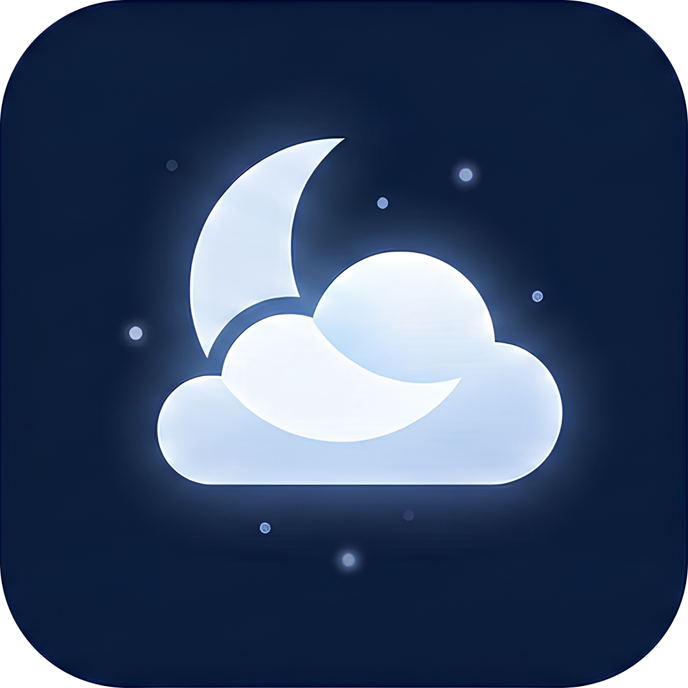
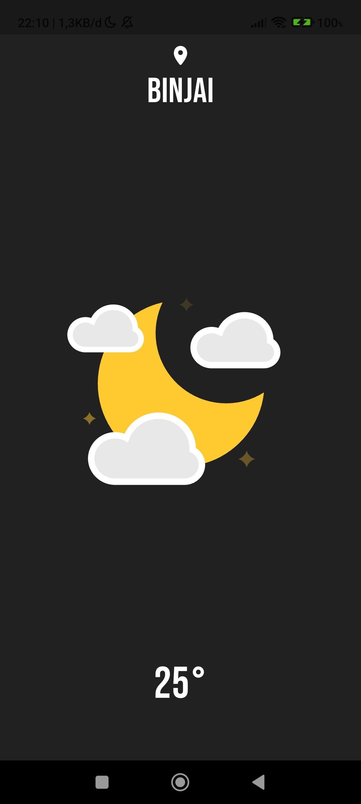
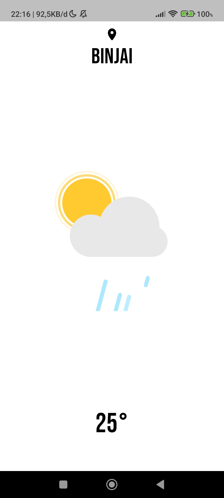

<div>
  
  
  
</div>

# Weathix ☀️🌧️

A modern, cross-platform weather app built with **Flutter**. Get real-time weather updates, beautiful Lottie animations, and a clean UI for your city.

## ✨ Features

- 🌤️ **Current Weather** — Real-time weather data for your current location
- 📍 **Location-based** — Auto-detects your city using device location
- 🎬 **Animated UI** — Weather conditions visualized with Lottie animations
- 🌓 **Day/Night Mode** — UI adapts to day or night automatically

## ☁️ Weather Data Provider


This app uses the [OpenWeather](https://openweathermap.org/api) API to fetch real-time weather data.

- Register and get a free API key at [OpenWeatherMap Sign Up](https://home.openweathermap.org/users/sign_up)
- Add your API key to the `.env` file in the project root:
  ```
  OPENWEATHER_API_KEY=your_api_key_here
  ```
- API documentation: [Current Weather Data](https://openweathermap.org/current)

## 🛠️ Tech Stack

- **Framework**: 
- **Language**: 
- **Location**: [geolocator](https://pub.dev/packages/geolocator), [geocoding](https://pub.dev/packages/geocoding)
- **Animation**: [lottie](https://pub.dev/packages/lottie)

## 📁 Project Structure

```
weathix/
├── lib/
│   ├── main.dart            # App entry point
│   ├── models/              # Data models (Weather)
│   ├── pages/               # UI pages (WeatherPage)
│   └── services/            # API and location services
├── assets/                  # Lottie animations, icons
├── android/                 # Android native config
├── ios/                     # iOS native config
├── web/                     # Web support
├── test/                    # Unit/widget tests
├── pubspec.yaml             # Dependencies & assets
└── .env                     # API keys (not committed)
```

## 📄 License

MIT License — feel free to use this project for your own weather app!

## 👨‍💻 Author

**Dirga Yuditama**
- GitHub: [dirgaydtm](https://github.com/dirgaydtm)
- LinkedIn: [dirgaydtm](https://linkedin.com/in/dirgaydtm)
- Website: [dirga.site](https://dirga.site)